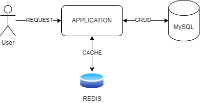
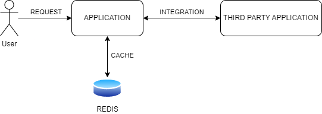
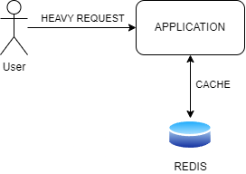
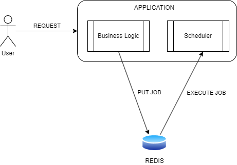

## Mengapa Redis?

<p>
Redis memiliki konsep database seperti pada relational database MySQL atau PostgreSQL. Di relational database kita bisa membuat database dengan menggunakan nama database, namun di redis kita hanya bisa menggunakan angka sebagai database.

Secara default database di redis adalah 0 (nol). Kita bisa menggunakan database sejumlah maksimal sesuai dengan
konfigurasi yang digunakan pada file `redis.conf`.

```bash
# Set the number of databases. The default database is DB 0, you can select
# a different one on a per-connection basis using SELECT <dbid> where
# dbid is a number between 0 and 'databases'-1

databases 16
```

</p>

## Kapan Kita Menggunakan Redis?

<p>
Redis adalah salah satu database yang sangat cepat. Redis memiliki kecepatan yang sangat tinggi karena data disimpan di dalam memory (RAM). Redis sangat cocok digunakan untuk menyimpan data yang bersifat temporary, seperti session, cache, dan message queue. Selain itu, redis juga sangat cocok digunakan untuk menyimpan data yang bersifat volatile, seperti data yang akan dihapus dalam waktu tertentu.

Namun, dengan menggunakan memory sebagai tempat penyimpanan utamanya, otomatis harga yang dikelurkan untuk menggunakan
Redis akan lebih mahal dibandingkan dengan database yang menggunakan disk sebagai tempat penyimpanan datanya.

Sebelum kita menggunakan redis, kita perlu melihat detail kasusnya terlebih dahulu. Salah satunya adalah sebagai
berikut:

### 1. Database Utama Lambat

<p align="center">
    
</p>

Saat pertama kali user request ke aplikasi, aplikasi akan mengambil data dari database utama. Hasil dari request
tersebut, akan disimpan di dalam redis, lalu dikembalikan ke user. Saat user melakukan request yang sama, aplikasi akan
mengambil data dari redis, bukan dari database utama.

### 2. Aplikasi Lain Lambat

<p align="center">
    
</p>

Misalnya, user melakukan request ke aplikasi dan aplikasi kita mengambil data dari aplikasi lain (Third Party
Application). Permasalahannya adalah aplikasi lain tersebut lambat. Saat aplikasi kita mengambil data dari aplikasi
lain, data tersebut akan disimpan di dalam redis.

Saat user melakukan request yang sama, aplikasi kita akan mengambil data dari redis, bukan dari aplikasi lain.

### 3. Melakukan Proses yang Berat Di Aplikasi

<p align="center">
    
</p>

Misalnya, user melakukan request ke aplikasi yang dimana aplikasi kita melakukan proses kalkulasi yang berat. Hasil dari
proses tersebut akan disimpan di dalam redis.

Saat user melakukan request ke aplikasi dan hasil kalkulasi sama, aplikasi kita akan mengambil data dari redis, bukan
melakukan proses yang berat tersebut.

### 4. Membuat Delayed Job

<p align="center">
    
</p>

Misalnya, kita ingin mengirim email ke user setelah user melakukan registrasi. Kita bisa membuat job yang akan
dijalankan setelah beberapa waktu. Job tersebut akan disimpan di dalam redis, lalu akan dikembalikan langsung ke user
dengan keterangan sukses. Di sisi lain, terdapat scheduler yang mengambil data email dan mengirim secara paralel.

</p>
